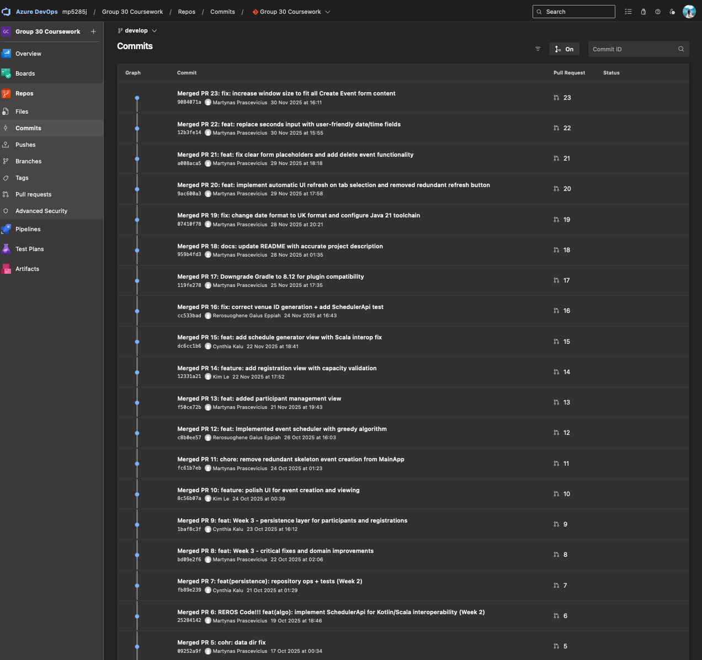
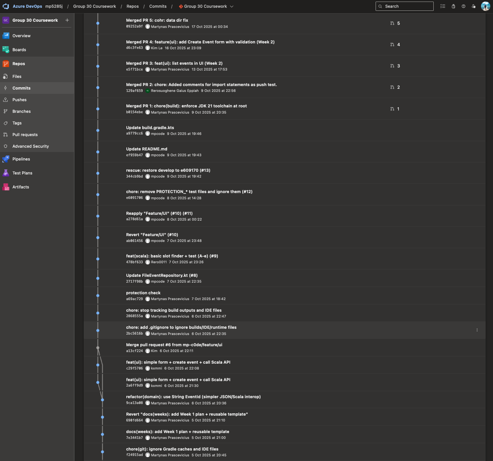
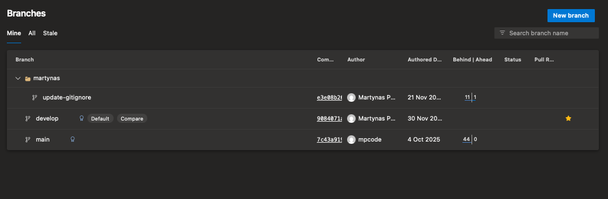

# Event Planning Application

**Course:** COMP1815 - JVM Languages
**University:** University of Greenwich
**Academic Year:** 2024-25
**Group:** Group 30

---

## Overview

A multi-module event planning application demonstrating **polyglot JVM development** with Kotlin, Scala 3, and JavaFX. The application provides a graphical interface for managing events and venues with intelligent slot-finding algorithms.

### Key Features

- **Multi-language Architecture** - Kotlin (UI & Domain), Scala 3 (Algorithms)
- **JavaFX 21 GUI** - Modern desktop interface
- **Gradle Multi-module Build** - Clean separation of concerns
- **JSON Persistence** - File-based data storage with Jackson
- **Functional Programming** - Scala 3 LTS for algorithm implementation
- **Domain-Driven Design** - Clear domain model with data classes

---

## Technical Stack

- **Languages:** Kotlin, Scala 3 LTS, Java
- **GUI Framework:** JavaFX 21
- **Build Tool:** Gradle 8.x with Kotlin DSL
- **JSON Library:** Jackson
- **JVM:** JDK 21+

---

## Project Structure

```
event-planner-jvm/
├── domain/                      # Kotlin domain model
│   └── Event, Venue data classes
├── persistence/                 # JSON repository layer
│   └── Jackson-based file storage
├── algo-scala/                  # Scala 3 algorithms
│   └── SlotFinderApi implementation
├── app-kotlin-ui/               # JavaFX application
│   └── Main UI with Kotlin
├── data/                        # JSON data files (gitignored)
└── build.gradle.kts             # Root build configuration
```

---

## Getting Started

### Prerequisites

- **Java Development Kit (JDK) 21+**
- **Gradle** (wrapper included)

### Building the Project

#### On macOS/Linux:
```bash
./gradlew build
```

#### On Windows:
```bash
.\gradlew.bat build
```

### Running the Application

#### On macOS/Linux:
```bash
./gradlew :app-kotlin-ui:run
```

#### On Windows:
```bash
.\gradlew.bat :app-kotlin-ui:run
```

---

## Architecture

### Module Dependencies

```
app-kotlin-ui  →  algo-scala  →  domain
                ↘  persistence  →  domain
```

### Design Patterns

- **Repository Pattern** - JSON file persistence abstraction
- **Facade Pattern** - Scala API called from Kotlin
- **Domain Model** - Immutable data classes in Kotlin
- **Functional Programming** - Scala 3 for algorithm logic

---

## Learning Outcomes

This project demonstrates:

- **Polyglot JVM Development** - Seamless interop between Kotlin, Scala, and Java
- **Multi-module Architecture** - Clean separation of concerns with Gradle
- **Functional Programming** - Scala 3 LTS for algorithmic implementation
- **GUI Development** - JavaFX with Kotlin
- **Build Automation** - Gradle with Kotlin DSL
- **Data Persistence** - JSON serialisation with Jackson

---

## Module Descriptions

### `domain`
Kotlin data classes representing the core domain model:
- `Event` - Event entity with properties
- `Venue` - Venue entity with capacity and location
- Immutable by default (Kotlin data classes)

### `persistence`
JSON-based repository layer using Jackson:
- File-based storage
- Read/write operations
- Data serialisation/deserialisation

### `algo-scala`
Scala 3 LTS implementation of slot-finding algorithms:
- `SlotFinderApi` - Main API interface
- Functional approach to algorithm design
- Called from Kotlin via JVM interop

### `app-kotlin-ui`
JavaFX desktop application in Kotlin:
- Main UI window
- Event handlers
- Integration with Scala algorithms and persistence

---

## Development Workflow (Azure DevOps)

This project was developed on **Azure DevOps** using a full Agile Git workflow with a team of 4 contributors. The GitHub repository contains the final codebase, while the complete development history (23 merged Pull Requests, feature branches, code reviews) lives on Azure DevOps.

### Commit History and Pull Requests

The team followed a structured PR-based workflow with conventional commit messages (`feat:`, `fix:`, `docs:`, `chore:`), code reviews, and a `develop` to `main` branching strategy.

**23 merged Pull Requests** spanning 8 weeks of development (Oct -- Nov 2025):





### Branching Strategy

Used `main` + `develop` + feature branches per developer:



### Development Timeline

| Week | PRs | Key Milestones |
|------|-----|---------------|
| Week 1 (Oct 5-11) | PR 1-9 | Project setup, domain model, persistence layer, Kotlin/Scala interop |
| Week 2 (Oct 12-24) | PR 10-14 | UI development, event creation, registration views, capacity validation |
| Week 3 (Oct 25 - Nov 7) | PR 15-17 | Schedule generator, Gradle fixes, Scala algorithm integration |
| Week 4 (Nov 8-30) | PR 18-23 | Documentation, date formatting, UI polish, delete functionality |

---

## Development Notes

### Tested Environment
- **OS:** macOS Sequoia
- **JDK:** OpenJDK 21+
- **Gradle:** 8.x with Kotlin DSL

### Known Limitations
- Data stored in local JSON files (no database)
- Basic UI with two main buttons
- No authentication or user management

---

## Team

This was a collaborative group project (Group 30) developed as part of COMP1815 coursework with 4 contributors working on Azure DevOps.

---

## License

This project was created for academic purposes as part of university coursework.

---

## Author

**Martynas Prascevicius**
- Email: mpcode@mpcode.dev
- Website: [mpcode.dev](https://mpcode.dev/)
- LinkedIn: [linkedin.com/in/mpc0de](https://linkedin.com/in/mpc0de)
- GitHub: [github.com/mp-c0de](https://github.com/mp-c0de)

---

*Built for COMP1815 - JVM Languages coursework at University of Greenwich*
